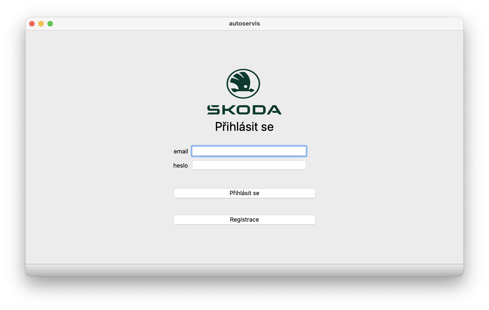
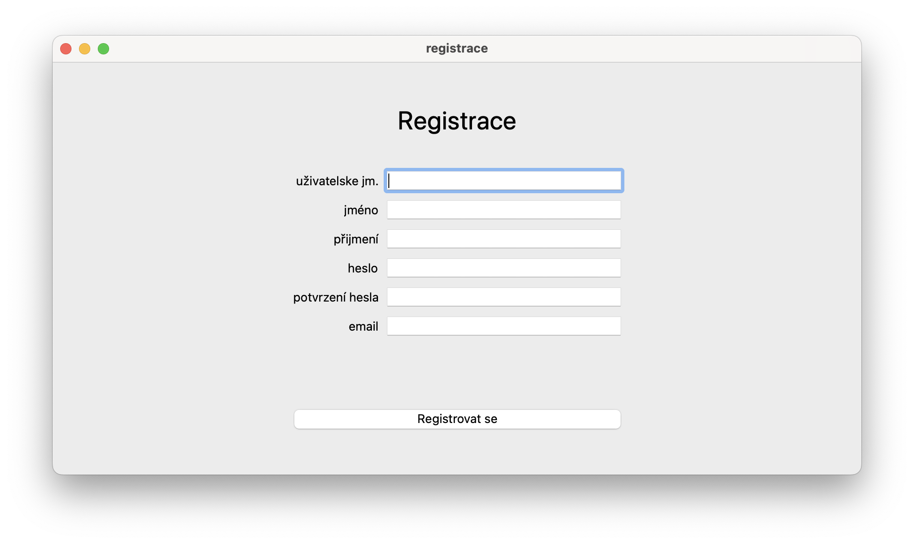
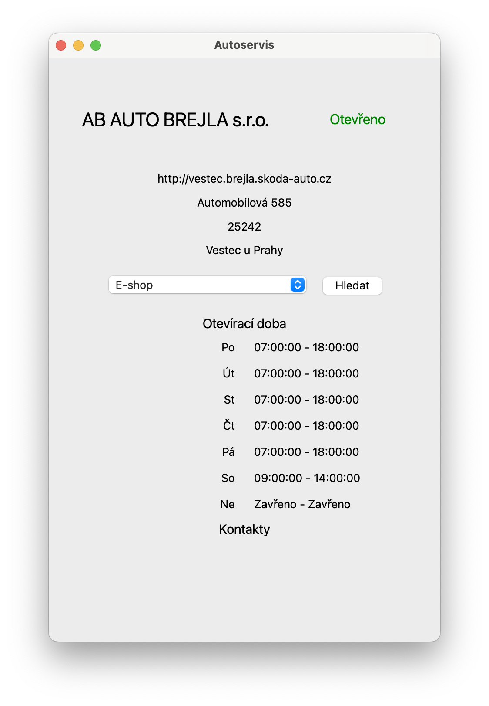

# Autosservis škoda auto
## Radek Koblic
#### školní závěrečný projekt pro střední průmyslovou školu elektrotechnickou v Ječné

- Aplikace se rozděluje na 3 rozhraní:
  - rozhraní pro běžného užiatele
  - rozhraní pro zaměstnance servisu
  - rozhraní pro vytvoření nového účtu pro zaměstnance

- O aplikaci:
  - AUTOR: Radek Koblic
  - NAZEV PROJEKTU: Autosservis škoda auto
  - EMAIL: radakoblic@gmail.com
  - VYPRACOVANO: 12.4.2023
  - SKOLA: SPSE Jecna Praha 2
  - TYP PROJEKTU: jedná se o školní více účelový projekt zaměřený na práci s databází

- Instalace:
  - instalace pro uživatele je prostá, pouze si stáhne aplikaci a může pracovat
  - to samé platí i pro ostatní

### POUŽITÍ
#### Uživatelské rozhraní
##### Přihlášení

- toto okno se vám zobrazí po spuštění aplkace
- pokud nemáte již účet kliknete na tlačítko 'Registrace'
- pokud máte účet vytvořen můžete se přihlásit do aplikace pomocí formuláře

##### Registrace

- zde vyplníte všechny požadovaneé okénka
- program je zcela ochráněn oproti špatným inputům, takže e nemusíte obávat
- pokud by došlo k nesplňujícím podmínkám, bude vše napsáno pod formulářem

##### Hlavní okna uživatele

- po přihlášení se vám zobrazí okno pro vytvoření objednávky
- pro vytvoření objednávky je potřeba vyplnit formulář a řídit se potažmo chybovými hláškami
- dále je možno kliknutím na ikonku panáčka zobrazit malé podkono pro informace o uživateli
  
  - a dále je možno jej zavřít buď křížkem nebo ikonkou domečku
- vedle ikonky panáčka je tlačítko autoservisy
  - zde je přehled všech autorizovaných servisů v ČR
  
  - a je možno si vybrat jednotlivý autoservis a vyhledat si informace ohledne otevírací doby, kontaktu a mnoho dalšího
  
  - zde možno si najít základní informace ohledně autoservisu
  - pokud se potřebujete obrátit na určité oddělení je možno pomocí listu najít zaměření a pomocí tlačítka hledat se vše aktualizuje a zobrazí
  
  - a také pokud v dobu hledání autoservis má autoservis zavřeno, zobrazí se to v pravém horním rohu automaticky
  
- po přepnutí na úvodní straně z vytvořit objednávku na odpovědi, tak se vám změní rozhraní a můžete vidět odpovědi od zaměstnanců autoservisu na vaši objednávku

- objednávky se vyhledávaji podle prvního sloupce 'objednávka_id'
- máte zde možnost kliknutím na ikonu refresh za účelem obnovení tabulky odpovědí
- jemožno vidět odpovědi v tabulce kde poslední sloupec udává jejich stav:
  - ⏳= objednávka je ve stavu nepotvrzená ani nezrušená
  - ✅= ojednávka je ve stavu potvrzená
  - ❌= objednávka je ve stavu zrušená
  - ! pokud je objednávka potvrzená nebo zrušená tak s ní již nejde nic dělat !
- po kliknutí na tlačítko vyhledat se správným ID objednávky, zobrazí se okno s přehledem objednávky
  
  - zde vidíte všechna důležitá informace která potřebujete
  - rozhodnutí je na uživateli zda mu termín vyhovuje nebo ne
  - a podle rozhodnutí vybere buď tlačítko potvrdit, čím potvrdí objednávku nebo zrušit, čím ji zruší
- v každdém okně pokud je tlačítko 'odhlásit se', tak je to takový směrovač na úvodní přihlašovací okno

#### Zaměstnanecké rozhraní
##### Přihlášení

- toto je uvítací okno při spuštění aplikace
- zde si zaměstnanec vybírá svůj autoservis a zadává své přihlašovací údaje(jméno a heslo)
- po vyplnění formuláře se může zaměstnanec přihlásit

##### Hlavní okna zaměstnance

- úvodní okno je přehled všech vytvořených objednávek od uživatelů
- ojednávky jsou setřízené podle datumu a pouze do aktuálního datumu
- zaměstnanec si může vyfiltrovat tabulku objednávek dle informací:
  - dle modelu automobilu
  
  - dle typu servisu
  
  - dle typu stavu (zodpovězeno/nezodpovězeno)
  
- a potvrzení fitrace je ikonou refresh
- pokud si zaměstnanec vybere objednávku na kterou chce odpovědět, tak zadá objednavka ID do vyhledavace a klikne na tlačítko Hledat -> zobrazí se okno na vytvoření odpovědi

  - zde zaměstnanec vyplní formulář a odešle uživateli do listu odpovědí
- pokud zaměstnanec chce mít přehled na pracovním rozvrhem dne (co ho daný den čeká), klikne na tlačítko kalendář

  - zde zaměstnanec si může vybrat jakýkoli den z kalendáře a podívat se co ho čeká za práci
  - vidí zde jak přijaté jak i zrušené akce aby měl přehled o objednávkách
- v každdém okně pokud je tlačítko 'odhlásit se', tak je to takový směrovač na úvodní přihlašovací okno

#### Zaměstnanecké rozhraní pro vytvoření účtu
##### Registrační okno

- toto okno je vytvořeno pro vutvření účtu zaměstnanci pro jednotlivý autoservis
- po vyplnění formuláře se může vytvořit nový účet pro autoservis a dále se přez něj přihlašovat do aplikace pro zaměstnance
